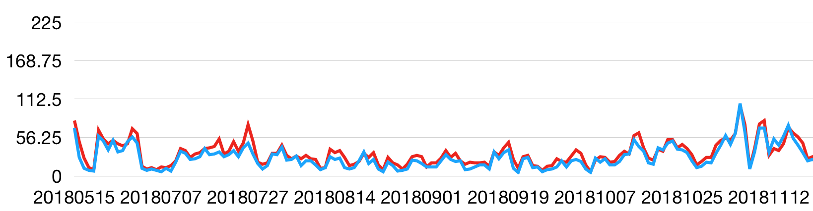

# 미세먼지 농도 분포를 이용한 미세먼지의 발생지 분석

2019년 한성과학고 융합과학의날 해커톤에서 만든 작품입니다.

## 개요
이 프로젝트는 서울시의 2018/05/15 ~ 2019/05/15 동안 일별 미세먼지 농도 데이터를 이용해 바람에 의한 미세먼지의 이동을 분석하고, 이를 통해 미세먼지의 발생지를 추측하는 프로젝트입니다.

## 아이디어 설명
### 가설

서울에 미세먼지가 균일하게 분포하고 있는 상태라고 가정하면, 서울에 서풍이 불 경우 서울 서쪽에 있던 미세먼지가 서울 서쪽에 밀집하게 되고, 반대로 동풍이 불 경우 서울 동쪽의 미세먼지 농도가 증가할 것이라는 가설을 세웠다. 
-------
### 미세먼지 농도 분석

