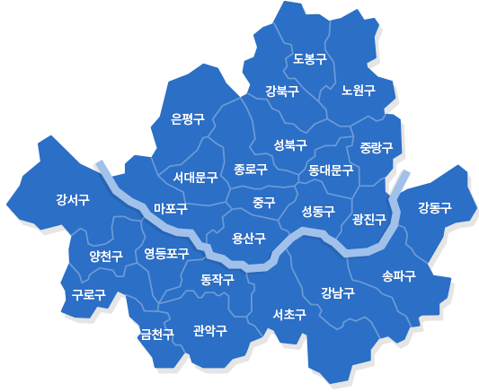
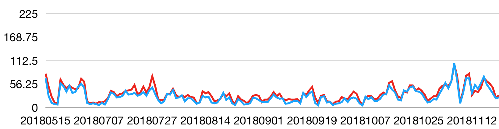
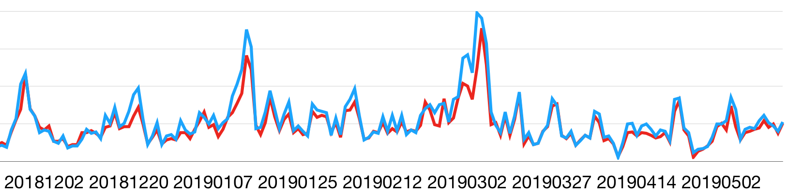

# 미세먼지 농도 분포를 이용한 미세먼지의 발생지 분석

2019년 한성과학고 융합과학의날 해커톤에서 만든 작품입니다.

## 개요

이 프로젝트는 서울시의 2018/05/15 ~ 2019/05/15 동안 일별 미세먼지 농도 데이터를 이용해 바람에 의한 미세먼지의 이동을 분석하고, 이를 통해 미세먼지의 발생지를 추측하는 프로젝트입니다.

## 아이디어 설명

### 가설

서울에 미세먼지가 균일하게 분포하고 있는 상태라고 가정하면, 서울에 서풍이 불 경우 서울 서쪽에 있던 미세먼지가 서울 서쪽에 밀집하게 되고, 반대로 동풍이 불 경우 서울 동쪽의 미세먼지 농도가 증가할 것이라는 가설을 세웠다.

### 미세먼지 농도 분석

위의 그래프가 2018년 5월부터 2018년 11월 까지 강동구(적)와 강서구(청)의 일별 미세먼지 농도를, 아래 그래프의 경우 2018년 11월 부터 2019년 5월 까지 미세먼지 농도를 그린 것이다.

### 해석

위의 그래프에서 5월 부터 11월까지는 강동구, 12월 부터 5월 까지는 강서구의 미세먼지 농도가 높은 것을 확인 할 수 있다.

처음 세운 가설에 따라 강동의 미세먼지 농도가 높은 5월 부터 11월 까지는 동풍이, 12월 부터 5월 까지는 서풍의 영향이 지배적인 것이라고 추측할 수 있다.

실제로 5-11월에는 북태평양 기단에 의해 동풍이, 12-5월까지는 시베리아 기단에 의해 서풍이 부니, 추측한 결과가 실제와 잘 맞는 것을 확인할 수 있다.

### 결론

따라서, 동풍이 부는 5-11월에는 경기 동부와 강원도에서 오는 미세먼지가 서울에 큰 영향을 주고, 서풍이 우세한 12-5월에는 중국, 경기 서부, 인천에서 발생한 미세먼지가 서울에 영향을 주는 것을 확인할 수 있다.
